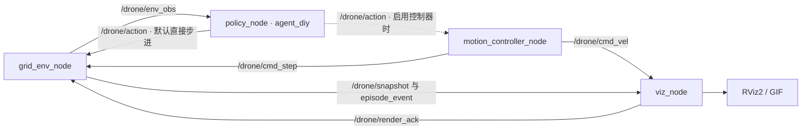
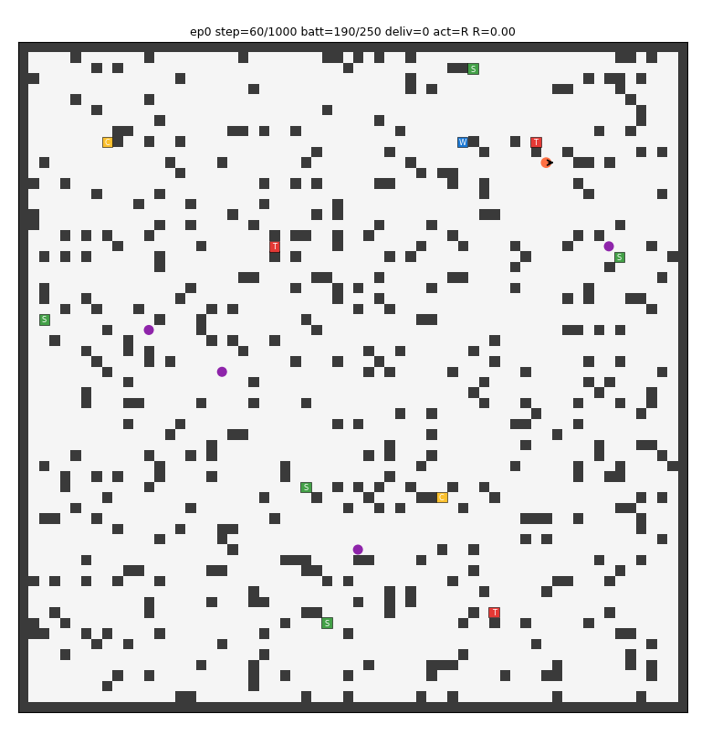

# kaiwu-drone-ros

面向开悟「无人机配送」任务的强化学习与 ROS 2 仿真项目。仓库包含自定义 PPO 智能体、模型检查点、ROS 2 节点、RViz2 可视化和离线回放工具，用于研究配送决策、动态避障及栅格动作的连续显示。

> **当前运行前提：** 仓库尚未包含 `closeloop/env/` 环境实现，但本地回放和 ROS 2 节点都依赖它。全新克隆后，需要先从项目原始开发环境补齐该模块，才能运行本文中的仿真示例。详见[运行前提](#运行前提)。

## 目录

- [功能与结构](#功能与结构)
- [运行前提](#运行前提)
- [安装与构建](#安装与构建)
- [运行仿真](#运行仿真)
- [参数与 ROS 接口](#参数与-ros-接口)
- [智能体与训练](#智能体与训练)
- [常见问题](#常见问题)
- [RACER 参考代码](#racer-参考代码)

## 功能与结构

- **配送策略：** `agent_diy` 使用按实体分组的 Actor-Critic 网络，结合自身状态、驿站、NPC、充电桩、仓库、局部地图和动作风险特征，输出 8 个方向的离散动作。
- **事件驱动闭环：** 环境发布观测，策略推理后返回动作；每完成一步，再生成下一次观测。
- **可选运动控制：** 将离散动作转换为一段时间内的速度指令，在时间窗口结束后提交栅格步进；支持抑制连续反向动作。
- **可视化与回放：** 发布点云、地图标记、无人机和轨迹标记；支持 RViz2 展示与 GIF/PNG 导出。
- **地图资源：** 包含 10 张无人机配送 JSON 地图及 RACER 的 PCD 场景；环境节点提供地图来源和感知范围参数。



`use_motion_controller` 默认关闭。开启后，环境改为订阅控制器的 `/drone/cmd_step`。这里的“到达”按 `step_seconds` 计时判断，适用于栅格仿真与显示，未接入真实无人机的位置反馈或飞控。

### 仓库布局

```text
.
├── agent_diy/                   # 自定义 PPO、特征工程、训练流程和历史权重
├── agent_ppo/                   # 基础 PPO 实现
├── ckpt/                        # 默认推理权重 model.ckpt-1712039.pkl
├── closeloop/
│   ├── framework_stub/          # 本地运行所需的开悟接口替身
│   ├── render/                  # Matplotlib 回放渲染器
│   ├── run/eval_local.py        # 非 ROS 的本地回放入口
│   └── out/                    # 已保存的示例图片
├── conf/                       # 开悟算法注册与训练、评测配置
├── ros2_ws/src/drone_grid_sim/
│   ├── drone_grid_sim/nodes/    # 环境、策略、控制器、可视化节点
│   ├── launch/                 # closed_loop.launch.py
│   └── rviz/                   # RViz2 配置
├── tmp_official_maps/           # JSON 地图、配置与 Lua 脚本
└── RACER/                      # ROS 1 多无人机探索参考代码与 PCD 地图
```

仓库中保存的一张回放示例帧（历史输出，不代表当前默认配置的评测结果）：



## 运行前提

### 补齐本地环境模块

以下接口被现有代码直接引用，但对应的 `closeloop/env/` 目录尚未纳入仓库：

- `closeloop.env.GridDroneEnv`：环境初始化、`reset()`、`step()`、`snapshot()`。
- `closeloop.env.official_map.load_cell_type_palette`：地图颜色配置。
- `closeloop.env.racer_map`：点云加载、栅格高度图转换及已探索区域过滤函数。

需要补齐这些接口及其配套实现、依赖。`tmp_official_maps/` 的地图和脚本不能代替此 Python 模块。根目录 `.gitignore` 中的 `env/` 规则也会匹配 `closeloop/env/`；维护者补充源码时，应一并调整忽略规则。

### 软件环境

- 已安装 ROS 2、`colcon` 和 RViz2 的 Linux 环境；使用图形界面需要可用的显示服务。
- Python、NumPy、PyTorch、Matplotlib、Pillow、ImageIO；Python 3.10 读取 TOML 时还需要 `tomli`。
- ROS 包：`rclpy`、`rcl_interfaces`、`std_msgs`、`geometry_msgs`、`nav_msgs`、`sensor_msgs`、`visualization_msgs`、`tf2_ros`、`launch`、`launch_ros`、`ament_index_python`。

下面以 **Ubuntu 22.04 + ROS 2 Humble + 系统 Python 3.10** 为命令示例。仓库未提供依赖锁定文件或经验证的跨版本兼容矩阵。先按 [ROS 2 Humble 官方安装说明](https://docs.ros.org/en/humble/Installation/Ubuntu-Install-Debs.html) 安装桌面版及开发工具；其他发行版需替换相应路径。

Python 虚拟环境应由 ROS 2 对应的系统解释器创建，以便使用 `rclpy`，参见 [ROS 2 Python 包使用说明](https://docs.ros.org/en/humble/How-To-Guides/Using-Python-Packages.html)。当前 `package.xml` 和 `setup.py` 未完整声明运行依赖，仅安装本 ROS 包不足以准备全部环境。

## 安装与构建

以下命令使用 Bash。在补齐 `closeloop/env/` 后继续执行导入检查和仿真。

```bash
git clone https://github.com/BabyDrangoner/kaiwu-drone-ros.git
cd kaiwu-drone-ros
export KAIWU_REPO="$PWD"

source /opt/ros/humble/setup.bash
sudo apt install python3-venv
/usr/bin/python3 -m venv --system-site-packages .venv
source .venv/bin/activate
python -m pip install setuptools colcon-common-extensions \
  numpy torch matplotlib pillow imageio tomli
# 确保 colcon 入口使用虚拟环境解释器，即使系统已经安装过 colcon。
python -m pip install --ignore-installed --no-deps colcon-core

# 从仓库根目录检查依赖；缺少 closeloop/env/ 时会在这里报错。
python -c "import rclpy, torch, numpy; import closeloop.framework_stub; from closeloop.env import GridDroneEnv; from closeloop.render import FrameRecorder"

cd "$KAIWU_REPO/ros2_ws"
"$KAIWU_REPO/.venv/bin/colcon" build --symlink-install --packages-select drone_grid_sim
source install/setup.bash
cd "$KAIWU_REPO"
```

仅构建 `ros2_ws` 中的 ROS 2 包即可。`RACER/` 使用 ROS 1/catkin，单独运行它时请遵循其自身文档。

每次打开新终端，进入仓库根目录后重新设置环境：

```bash
export KAIWU_REPO="$PWD"
source /opt/ros/humble/setup.bash
source "$KAIWU_REPO/.venv/bin/activate"
source "$KAIWU_REPO/ros2_ws/install/setup.bash"
```

`KAIWU_REPO` 必须指向本仓库的绝对路径。节点的内置回退路径为 `/root/workspace/kaiwu-drone`，通常不适用于新机器。启动文件还会直接调用 `python`，因此运行时应保持上述虚拟环境已激活。

## 运行仿真

以下示例均要求环境模块已补齐、依赖检查通过，并在仓库根目录运行。

### ROS 2 与 RViz2

```bash
test -f "$KAIWU_REPO/ckpt/model.ckpt-1712039.pkl" && \
ros2 launch drone_grid_sim closed_loop.launch.py \
  ckpt_dir:="$KAIWU_REPO/ckpt" \
  episodes:=1 seed:=42
```

默认使用 `official_json` 地图来源，打开 RViz2，并由策略动作直接推进栅格环境。先确认权重文件存在，再检查 Agent 输出的 `load model <完整路径>` 日志。当前实现对缺失文件会静默跳过加载，策略节点仍可能打印 `[policy] loaded ...`；加载抛出异常时才会记录警告。未成功加载权重时仍可能使用随机初始化模型，不能将其运行结果视为已训练模型的表现。

启用按时间推进的运动控制和插值显示：

```bash
ros2 launch drone_grid_sim closed_loop.launch.py \
  ckpt_dir:="$KAIWU_REPO/ckpt" \
  use_motion_controller:=true step_seconds:=0.12 \
  control_rate_hz:=30.0 anti_oscillation:=true
```

控制器的 `anti_oscillation` 会将紧接着的反向动作替换为上一方向；需要观察原始策略行为时，可设为 `false`。

### 无桌面运行与录制

```bash
ros2 launch drone_grid_sim closed_loop.launch.py \
  ckpt_dir:="$KAIWU_REPO/ckpt" \
  rviz:=false record_gif:=true \
  gif_out_dir:="$KAIWU_REPO/ros2_ws/gif_out" \
  episodes:=1
```

`rviz:=false` 只关闭 RViz2，`viz_node` 仍负责发布可视化数据、渲染确认和录制。GIF 在回合结束时保存到 `gif_out_dir`。达到 `episodes` 后环境节点退出，其余节点可能仍在运行，使用 **Ctrl+C** 结束整个 launch。

### 非 ROS 本地回放

这个入口通过 `framework_stub` 适配开悟接口，无需启动 ROS 节点：

```bash
python -m closeloop.run.eval_local \
  --ckpt-dir ckpt --ckpt-id 1712039 \
  --episodes 1 --max-steps 200 --seed 42 \
  --out-dir closeloop/out --fps 8
```

输出包括回合步数、配送数、剩余电量、终止状态、累计环境奖励，以及 `episode_0000.gif` 和 `episode_0000_last.png`。省略 `--max-steps` 使用环境自身上限；添加 `--no-gif` 可关闭帧录制和图片导出。该入口同样依赖缺失的 `closeloop.env`。

## 参数与 ROS 接口

### 常用启动参数

下表列出 [closed_loop.launch.py](ros2_ws/src/drone_grid_sim/launch/closed_loop.launch.py) 的默认值；单独运行节点时，个别默认值不同。

| 参数 | 默认值 | 用途 |
| --- | --- | --- |
| `ckpt_dir` | `ckpt` | 权重目录，相对路径按 `KAIWU_REPO` 解析 |
| `episodes` / `seed` | `1` / `42` | 回合数与随机种子；`episodes:=0` 持续运行 |
| `map_source` | `official_json` | 地图来源；代码也引用 `racer_pcd` 地图加载接口 |
| `racer_map_name` | `pillar` | RACER 场景名 |
| `racer_resolution` / `racer_height_thresh` | `0.5` / `0.15` | PCD 栅格化分辨率与障碍高度阈值 |
| `grid_size` | `128` | 传给环境的栅格尺寸参数 |
| `drone_count` / `charger_count` / `station_count` | `4` / `3` / `10` | 环境 NPC 无人机、充电桩、驿站数量参数 |
| `max_step` / `battery_max` | `1000` / `250` | 每回合步数上限与电量上限 |
| `sensor_range_cells` / `sensor_fov_deg` / `sensor_ray_count` | `10` / `140.0` / `121` | 感知范围、视场角与射线数量 |
| `use_motion_controller` | `false` | 是否经运动控制器推进环境 |
| `step_seconds` / `control_rate_hz` | `0.12` / `30.0` | 单步运动时间与控制频率 |
| `throttle_step` / `anti_oscillation` | `true` / `true` | 控制器的延迟提交与反向动作抑制 |
| `sync_step_with_viz` | `true` | 环境等待可视化帧确认后继续步进 |
| `rviz` / `record_gif` | `true` / `false` | 打开 RViz2 / 录制回放 |
| `show_all_elements` | `false` | 是否显示全部实体元素 |
| `frame_id` | `map` | 可视化坐标系 |

地图参数的实际解释取决于补齐的环境实现。完整参数可查看源码，或在构建后运行：

```bash
ros2 launch drone_grid_sim closed_loop.launch.py --show-args
```

**检查点编号限制：** 当前 launch 声明了 `ckpt_id`，但没有将其传给 `policy_node`，所以直接使用 `ckpt_id:=其他编号` 不会改变策略节点的默认编号 `1712039`。切换编号前需修正启动文件的参数传递，或自行分别启动节点并为策略节点显式传入字符串类型的 `ckpt_id`。非 ROS 回放入口的 `--ckpt-id` 则已正常传递。

### 主要话题

| 话题 | 消息类型 | 数据流 |
| --- | --- | --- |
| `/drone/env_obs` | `std_msgs/msg/String` | 环境 → 策略，JSON 观测 |
| `/drone/action` | `std_msgs/msg/Int8` | 策略 → 环境或可选控制器，动作 `0..7` |
| `/drone/cmd_step` | `std_msgs/msg/Int8` | 控制器 → 环境，提交一步 |
| `/drone/cmd_vel` | `geometry_msgs/msg/Twist` | 控制器 → 可视化，运动指令 |
| `/drone/snapshot` | `std_msgs/msg/String` | 环境 → 可视化，JSON 场景快照 |
| `/drone/episode_event` | `std_msgs/msg/String` | 环境 → 可视化，回合事件及统计 |
| `/drone/render_ack` | `std_msgs/msg/Int32` | 可视化 → 环境，帧确认 |
| `/drone/occupancy_cloud`、`/drone/unknown_cloud` | `sensor_msgs/msg/PointCloud2` | 可视化 → RViz2，地图点云 |
| `/drone/markers_static`、`/drone/markers_dynamic` | `visualization_msgs/msg/MarkerArray` | 可视化 → RViz2，场景标记 |
| `/drone/drone_marker`、`/drone/trail_marker` | `visualization_msgs/msg/Marker` | 可视化 → RViz2，无人机与轨迹 |

控制器的动作编号依次为：`0` 右、`1` 右上、`2` 上、`3` 左上、`4` 左、`5` 左下、`6` 下、`7` 右下。这里使用栅格平面方向；转换为 ROS 速度时会对栅格纵向分量取反。

## 智能体与训练

默认算法在 [conf/app_conf_drone_delivery.toml](conf/app_conf_drone_delivery.toml) 中设为 `diy`；[algo_conf_drone_delivery.toml](conf/algo_conf_drone_delivery.toml) 同时注册了 `diy` 和 `ppo` 的 Agent 与训练工作流。

`agent_diy` 当前使用 **261 维观测特征、8 个离散动作**。模型按实体类型共享编码并做带掩码的均值/最大值池化，再与自身状态、局部地图和 27 维动作辅助特征拼接，接入策略头与价值头。输入维度和超参数见 [conf.py](agent_diy/conf/conf.py)，网络与旧权重适配逻辑见 [model.py](agent_diy/model/model.py)。

| 内容 | 位置 |
| --- | --- |
| 自定义 PPO 更新逻辑 | [agent_diy/algorithm/algorithm.py](agent_diy/algorithm/algorithm.py) |
| 特征提取与奖励塑形 | [agent_diy/feature/preprocessor.py](agent_diy/feature/preprocessor.py) |
| 训练采样与回合流程 | [agent_diy/workflow/train_workflow.py](agent_diy/workflow/train_workflow.py) |
| 训练环境参数 | [agent_diy/conf/train_env_conf.toml](agent_diy/conf/train_env_conf.toml) |
| 框架训练与评测配置 | [conf/configure_app.toml](conf/configure_app.toml) |
| 默认本地推理权重 | `ckpt/model.ckpt-1712039.pkl` |
| 历史权重 | `agent_diy/ckpt/model.ckpt-{788792,1233092,1301997}.pkl` |

完整训练和平台评测需要开悟客户端或配套运行时，提供 `kaiwudrl`、`common_python`、`tools` 及环境实例。仓库没有独立训练启动器；训练入口由框架调用 `agent_diy.workflow.train_workflow.workflow`。`framework_stub` 用于本地适配，不包含完整的训练调度与采样传输能力。

`configure_app.toml` 的预加载目录和评测目录仍是原开发环境的绝对路径，迁移时应按实际部署修改。平台预加载编号与本地仿真默认编号也不同，使用前需分别核对。[agent_diy/README.md](agent_diy/README.md) 保留了早期设计说明，其中的 234 维特征、部分训练参数和 `train_test.py` 启动示例已不对应当前仓库，应以源码和本页为准。

## 常见问题

| 现象 | 检查与处理 |
| --- | --- |
| `No module named 'closeloop.env'` | 补齐环境源码；仅设置路径或安装 PyPI 依赖无法解决缺失模块 |
| `No module named 'closeloop'` 或 `agent_diy` | 确认 `KAIWU_REPO` 为仓库根目录的绝对路径 |
| 找不到 `python`、`torch` 或 `rclpy` | 激活对应虚拟环境并 source ROS 2；确认 Python 与 ROS 二进制包匹配 |
| 找不到 `drone_grid_sim` | 在 `ros2_ws` 构建并 source `install/setup.bash` |
| 权重加载警告、模型表现异常 | 检查权重文件存在，并确认 Agent 的 `load model <完整路径>` 日志；`[policy] loaded` 不足以证明加载成功，还需注意 launch 的 `ckpt_id` 传递限制 |
| RViz2 无法打开 | 检查图形显示服务，或使用 `rviz:=false` |
| 环境等待可视化确认、不继续步进 | 检查 `viz_node` 和 `/drone/render_ack`；单独调试环境与策略时可关闭 `sync_step_with_viz` |
| 回合结束但终端未退出 | 环境节点结束后，使用 Ctrl+C 停止其他节点 |

在已加载同一工作空间环境的另一终端，可查看运行状态：

```bash
ros2 node list
ros2 topic list
ros2 topic echo /drone/episode_event
```

## RACER 参考代码

`RACER/` 保留了 [SYSU-STAR/RACER](https://github.com/SYSU-STAR/RACER) 的去中心化多无人机探索代码和 PCD 地图资源。其 ROS 1/catkin 构建流程、依赖与论文引用见 [RACER/README.md](RACER/README.md)。主项目的 ROS 2 栅格闭环有独立入口；使用 PCD 地图不意味着运行了 RACER 的完整探索算法。
